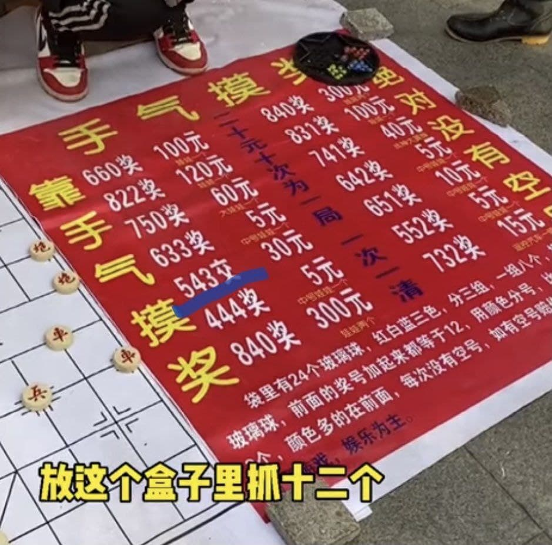

# Marble Drawing Scam Analysis

## The Original Game
One day my friend sent me the follow image and ask if this gambling game is even legit. It is a gambling game about marbles drawing, so we should be able to see if it is a scam by using simple maths and probability theory.



## Rules
1. A price of $20 can play this game 10 times
1. Each time darw 12 marbles from a pool of 24 marbles having 8 reds, 8 whites, and 8 blues respectively
2. Count the number of marbles that belong to each of the 3 color, then arrange the counts in descending order
3. Receive the corresponding rewards according to the payoff table
```python
payoffs = {
    '840': +300,
    '831': +100,
    '822': +120,
    '750': +60,
    '741': +40,
    '732': +15,
    '660': +100,
    '651': +10,
    '642': +5,
    '633': +5,
    '552': +5,
    '543': -30,
    '444': +5,
}
```
The `543` case corresponds to a negative number, meaning that when the result matches this case, the player will be punished instead of being rewarded.

## Probability
As this game has very clear finite outcomes in its probability spaces, we can easily calculate the probabilities of each of these payoff cases, which should sum up to 1.

## Expected Rewards
After calculating the probabilities for each of these outcomes, we simply multiple the payoffs to get the expected rewards for each outome, and sum them up to get the average reward for playing this game. Player's expected rewards can be calculated by subtracting the average cost of playing the game from the expected reward. Then we can judge if this is a fair game or not.

## Improvement on the Game
While the reward levels for this game may not be on a very good setting, thus it is possible to fine tune the rewards to make this game more interesting and exciting.